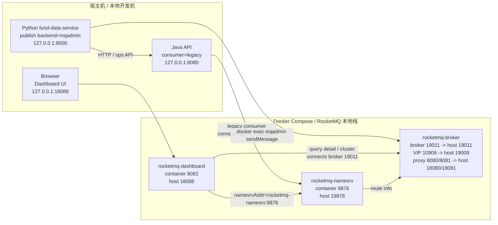
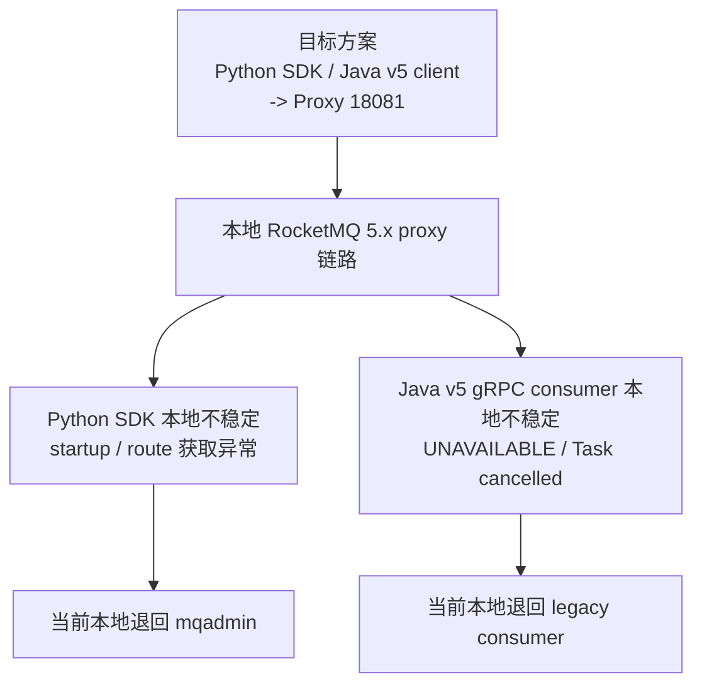
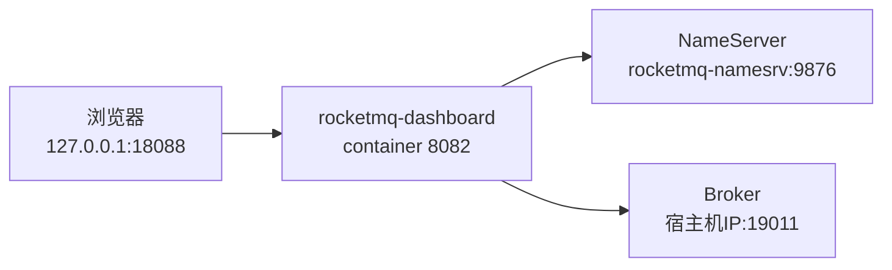
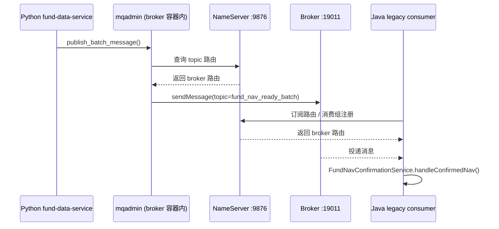

# RocketMQ 本地连接关系图

这张图基于当前项目本地实际运行方式整理，重点标出：

- 宿主机暴露端口
- 容器内通信端口
- Java / Python / Dashboard 分别连谁
- 本地推荐链路与预留链路

## 总览图

## 端口映射表

| 组件 | 宿主机端口 | 容器内端口 | 用途 |
| --- | --- | --- | --- |
| RocketMQ NameServer | `19876` | `9876` | Java legacy consumer、本地管理命令、路由注册 |
| RocketMQ Broker | `19011` | `19011` | Broker 主通信端口 |
| RocketMQ Broker VIP | `19009` | `10909` | 老式 VIP 通道；Dashboard 若未禁用 VIP 会误打这里 |
| RocketMQ Proxy | `18080` | `8080` | Proxy 暴露端口 1 |
| RocketMQ Proxy | `18081` | `8081` | Proxy 暴露端口 2，预留给 v5 gRPC 客户端 |
| RocketMQ Dashboard | `18088` | `8082` | 浏览器访问 |
| Java API | `8080` | - | 本地后端 |
| Python fund-data-service | `8000` | - | 本地数据服务 |

## 当前推荐连接方式

### 1. Java consumer

本地当前推荐：

- `FUNDCAT_ROCKETMQ_ENABLED=true`
- `FUNDCAT_ROCKETMQ_CONSUMER_MODE=legacy`
- `FUNDCAT_ROCKETMQ_ENDPOINTS=127.0.0.1:19876`

含义：

- Java 不直接连 proxy
- Java 通过 NameServer 拿 broker 路由
- 实际消费由 `LegacyRocketMqFundNavReadyBatchConsumer` 完成

对应代码：

- [LegacyRocketMqFundNavReadyBatchConsumer.java](/Users/winter/zxd/projects/CodexApps/FundCat/app/src/main/java/com/winter/fund/infrastructure/marketdata/LegacyRocketMqFundNavReadyBatchConsumer.java)
- [RocketMqFundNavReadyBatchConsumer.java](/Users/winter/zxd/projects/CodexApps/FundCat/app/src/main/java/com/winter/fund/infrastructure/marketdata/RocketMqFundNavReadyBatchConsumer.java)
- [RocketMqProperties.java](/Users/winter/zxd/projects/CodexApps/FundCat/app/src/main/java/com/winter/fund/common/config/RocketMqProperties.java)

### 2. Python producer

本地当前推荐：

- `FUNDCAT_PUBLISH_MODE=rocketmq`
- `FUNDCAT_ROCKETMQ_PUBLISH_BACKEND=mqadmin`
- `FUNDCAT_ROCKETMQ_ENDPOINTS=127.0.0.1:19876`

含义：

- Python 业务上负责发布
- 但实际发送动作不是 Python SDK 直发
- 而是通过 `docker exec fundcat-rmq-broker ... mqadmin sendMessage`
- `mqadmin` 在容器内再用 `rocketmq-namesrv:9876` 发消息

对应代码：

- [common.py](/Users/winter/zxd/projects/CodexApps/FundCat/fund-data-service/fund_data_service/common.py)
- [publish_test_message.py](/Users/winter/zxd/projects/CodexApps/FundCat/fund-data-service/scripts/publish_test_message.py)

## 为什么现在没有统一走 Proxy

当前结论：

- **本地开发**
  - Python：`mqadmin`
  - Java：`legacy`
- **预留正式环境**
  - Python：SDK
  - Java：v5 consumer

## Dashboard 的连接关系

补充说明：

- Dashboard 先通过 NameServer 拿到 broker 地址
- 再按 broker 地址查询 topic、message detail、consumer progress
- 之前页面报错的原因是 Dashboard 默认可能走 VIP 通道去打 `19009`
- 现在已经在 `docker-compose.yml` 里关闭 VIP 通道：
  - `-Dcom.rocketmq.sendMessageWithVIPChannel=false`

## 一条消息的真实流转

## 本地排障优先顺序

1. 看容器是否起来：
   - `docker ps`
2. 看 topic 是否存在：
   - `curl http://127.0.0.1:18088/topic/list.query`
3. 看 consumer 是否在线：
   - `mqadmin consumerConnection -g fundcat-fund-nav-consumer`
4. 看消费位点：
   - `mqadmin consumerProgress -g fundcat-fund-nav-consumer`
5. 看 Java 日志里是否出现：
   - `RocketMQ legacy fund_nav_ready_batch consumed`
